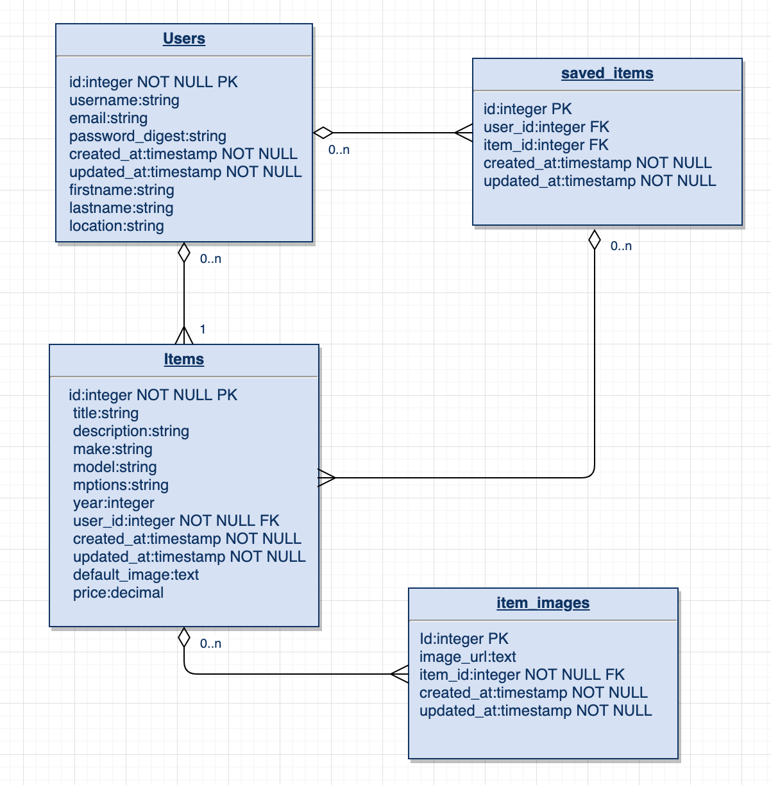

# "Garagelistings" Project Overview

### Project Description
GarageListings is a classified advertisements website devoted to vehicles and automotive parts.

### Technologies Used
React  
React Hooks  
Ruby  
Rails  

### External API
FuelEconomy.gov

### Wireframes

### Installation Instructions
#### Development:  
rails new . --api --database=postgresql  
npx create-react-app client  
rails g scaffold User username:string email:string password_digest:string  
rails db:create  
rails g controller Authentication  
rails g scaffold Item title description make model mptions year:integer user:references  
rails g scaffold ItemImage image_url:text item:references   
rails g model SavedItem user:references item:references  
rails db:migrate  
rails db:seed  
bundle install  
cd client  
npm install axios\nnpm install react-router-dom 
#### Production:   
TBD

### ERD:

#### MVP
* User can register
* User can log in
* Application will display all available listings\items
* User can create, update, view and delete a listing, including crud on images.
* Application will present populated data driven dropdowns for year, make, model and options of a vehicle when creating a listing.
* User can save\favorite or unsave\unfavorite a listing.
* User can add image links to a new listing.
* User can see listing details which includes contact of seller.   

#### POST MVP
* Collect addtional information about user for profile.
* Feedback system for buyers and sellers.
* Search functionality for items\listings.
* Listing fee\selling fee system.
* Q&A between buyer and seller which renders with the listing.

#### Functional Components
* Login
* Register
* Header
	* Home
		* MyItems
		* SavedItems
		* AllItems
		* AddItem
		* EditItem
		* ItemDetails 
		* ProfileDetailsModal 
* Footer

### Component	Description
**Header** - This will render the header include the nav.  
**Footer** -	This will render the header include the nav.  
**Home** - This will render the Form and main.   
**Login** - This will render the login form.  
**Register** - This will render the registration form.   
**MyItems** - This will render listings the current user created.   
**SavedItems** - This will render the listing the user has saved\favorite.   
**AllListings** - This will render all listings.
**CreateListing** - This will render the create listing form.   
**EditItem** - This will render the edit listing form.   
**ItemDetails** - This will render listing details.
**ProfileDetailsModal** - This will render current user profile as a modal.

### Routes

### Timeframes
Component  | Priority | Estimated Time | Time Invetsted
---------- | -------- | -------------- | --------------
Header  | Low | 1 hr  | 1 hrs
Footer | Low | 1 hr |  .5 hrs
Home | Med | 8 hrs | .5 hr
Login | High | 1.5 hrs | 1 hrs
Register | Low | 1.5 hrs | 1 hrs
MyListings | High | 2 hrs | 8 hrs
SavedListings | High | 2 hrs | 0.25 hr
AllListings | High | 4 hrs | 0.25 hr
CreateListing | Med | 4 hrs | 4 hr
ViewListing | Med | 4 hrs | 4 hr
App.js | High | 10hrs | 4 hrs

### Issues and Resolutions   
-ability to add a virtual attribute to a model. Attribute was used to calculate distance in time from created date. 
  - resolved the serialization issue with this code in the items model:
  attr_accessor :timedistance
  def attributes
    super.merge({'timedistance' => timedistance})
  end